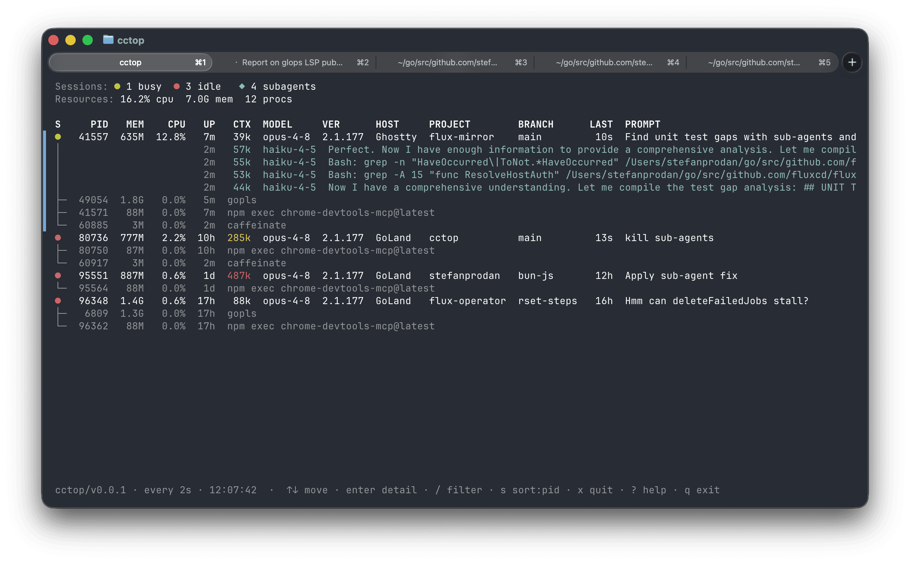

# cctop

Interactive top-style monitor for Claude Code sessions. Know at a glance what
Claude is working on, how much context it has left, and which sessions are
waiting for input.

<p align="center">
  
</p>

## Features

- **All your sessions at a glance** — every running Claude Code session in one
  table: process stats (PID, memory, CPU, uptime), busy/idle state, context
  size, model, host app (terminal or IDE), project, git branch, and last prompt.
- **Sub-agent & process tree** — live sub-agents (with their latest turn) and
  each session's sub-processes, open and orphaned TCP ports.
- **Live TUI** — navigate with the keyboard, open a per-session detail view, and
  filter and sort on the fly; piped or run with `--once` it prints a single frame.
- **Status at a glance** — busy sessions are green, idle red; CPU and context
  heat toward red as they climb; the selected session is marked with a blue bar.
- **Weekly usage limits** *(opt-in)* — show your Claude subscription's 5h/7d
  rate-limit usage in the summary line.
- **Quit a runaway session** in place (`x` → `SIGTERM`, with confirm), or
  **free ports** held by a session's leftover dev server
  (`f` in the detail view).
- **Session history** (`h`) — a dashboard over past sessions: a per-day
  token-usage chart, recent sessions, and breakdowns by model, tool/MCP, and
  project.
- **Read-only and local** — the TUI reads only `~/.claude` and the process table,
  spawns no processes.
- **Zero dependencies** — a single Bun program with no npm packages;
  it uses only the Bun runtime and OS built-ins.

## Install

On macOS or Linux, install the standalone binary with Homebrew:

```sh
brew install stefanprodan/tap/cctop
```

Or install it as a script with Bun:

```sh
bun install -g github:stefanprodan/cctop#v0.3.0
```

### Usage limits (opt-in)

To display the subscription's rate-limit usage, add the following to
your Claude Code [status-line](https://code.claude.com/docs/en/statusline) script:

```bash
input=$(cat)

# persist the account-wide 5h/7d rate limits
printf '%s' "$input" | cctop --capture-usage || true
```

With `--capture-usage` the rate limits stats are persisted to
`~/.claude/cctop/usage.json` from which the cctop TUI reads.
See [docs/usage-limits.md](docs/usage-limits.md) for more details.

### Update

With Homebrew:

```sh
brew upgrade stefanprodan/tap/cctop
```

Or upgrade the scrip to the latest [release](https://github.com/stefanprodan/cctop/releases) with Bun:

```sh
bun install -g github:stefanprodan/cctop#v0.3.0
```

### Uninstall

With Homebrew:

```sh
brew uninstall stefanprodan/tap/cctop
```

Or with Bun:

```sh
bun uninstall -g cctop
```

If you enabled usage limits, also remove the `cctop --capture-usage` line from
your Claude Code status-line script.

## Usage

On an interactive terminal `cctop` runs as a live TUI (like `top`); when piped,
redirected, or run with `--once` it prints a single frame and exits.

### Keys

While the TUI is running:

| Key             | Action                                                           |
|-----------------|------------------------------------------------------------------|
| `↑`/`k` `↓`/`j` | move the selection                                               |
| `PgUp`/`PgDn`   | jump 10 rows                                                     |
| `g` / `G`       | jump to top / bottom                                             |
| `enter`         | open the detail view for the selected session                    |
| `h`             | open the session history dashboard (`↹` tabs, `r` rescan)        |
| `esc`           | leave the detail view / close an overlay                         |
| `/`             | filter sessions (type, `enter` to apply)                         |
| `s`             | cycle the sort column (default, cpu, mem, ctx, pid)              |
| `x`             | quit the selected session (`SIGTERM`, with confirm)              |
| `f`             | reclaim the detail view's orphan ports (`SIGTERM`, with confirm) |
| `?`             | toggle the help overlay                                          |
| `q` / `Ctrl-C`  | quit cctop                                                       |

### Options

```
cctop [filter] [options]

  filter                 only show sessions whose project, host, branch,
                         model, or session id contains this
  -w, --watch[=seconds]  set the refresh interval (default: 1s, min 0.25s)
  --once                 render once and exit (default when piped)
  --json                 print full session details as JSON
  -v, --version          show version
  -h, --help             show this help
```

Examples:

```sh
cctop flux         # start filtered to sessions matching "flux"
cctop --watch=0.5  # refresh twice a second
cctop --once       # single frame, then exit
cctop --json       # machine-readable snapshot
```

## Contributing

`cctop` is open source and contributions are welcome — open an issue or send a
pull request on [GitHub](https://github.com/stefanprodan/cctop). See
[docs/CONTRIBUTING.md](docs/CONTRIBUTING.md) to get set up.

## License

[Apache 2.0](LICENSE)
